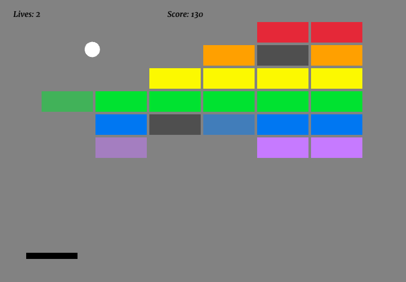

# Breakout Game

Breakout Game is a classic arcade game built with Rust and the `macroquad` game development framework. Its a simple game created using Rust, Docker, and CI/CD with GitHub Actions.



## Overview

In this Breakout Game, players control a paddle to bounce a ball against a set of bricks. The goal is to break all the bricks without letting the ball fall off the screen. The game includes features such as:

- Player-controlled paddle
- Ball movement and collision detection
- Multiple layers of bricks with varying colors
- Responsive game loop

## Table of Contents

- [Installation](#installation)
- [Usage](#usage)
- [Tests](#tests)
- [Acknowledgments](#acknowledgments)

## Installation

### Prerequisites

- [Docker](https://www.docker.com/get-started)
- [Rust](https://www.rust-lang.org/tools/install)


### Running Locally

1. Clone the repository:

    ```sh
    git clone https://github.com/joewnga/Breakout-game.git
    cd Breakout-game
    ```

2. Install Rust and Cargo if you haven't already. Link [here](https://www.rust-lang.org/tools/install)


3. Build and run the project:

    ```sh
    cargo run
    ```


### Running with Docker

1. Clone the repository:

    ```sh
    git clone https://github.com/joewnga/Breakout-game.git
    cd Breakout-game
    ```

2. Build and run the project using Docker:

    ```sh
    docker build -t Breakout-game .
    docker run -it --rm -p 8000:8000 Breakout-game
    ```

3. Open the project in Visual Studio Code:

    ```sh
    code .
    ```

4. Open the project in a Dev Container.

5. Run the game:

    ```sh
    cargo run
    ```

## Usage

Use the left and right arrow keys to move the paddle and keep the ball in play. Break all the bricks to win the game!


## Tests

Run unit and integration tests using the following command:

```sh
cargo test
```

## Acknowledgments

This project draws inspiration from and includes code from the [TanTanDev](https://github.com/TanTanDev/breakout_tutorial) repository.
